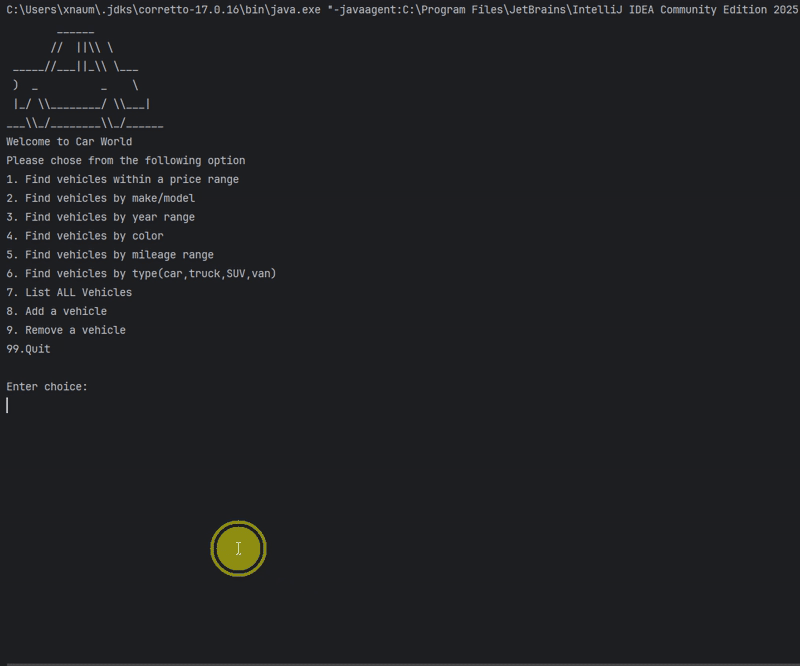

# Car Dealership Management System

## Description of the Project

This Java console application simulates a dealership inventory management system, which is useful for the employees of a dealership. 
The application allows users to search, add, and remove vehicles from inventory while maintaining persistent storage in a CSV file. 

## User Stories

- As a user I want to have the option to add vehicles so that my inventory is accurately represented. 
- As a user, I want each menu option to perform the correct action so that I can see results based on my request.
- As a user, I would like my dealership information to be stored correctly so that I can access the details and inventory reliably.
- As a user, I want to remove a vehicle so that my inventory is accurate and so my changes are saved after closing program. 
- As a user, I want the program to load my dealership information when it starts so that I can interact with my inventory.
- As a user, I want a display function to show the home screen menu so that I can interact with the dealership program.

## Developer Stories
- As a developer I want to create all the classes required for the dealership application so that the project has a complete structure for initial commit.
- As a developer I want to create a private helper method that will help me display different lists of vehicle so I don't have to repeat the same logic multiple times.
- As a developer, I want a method that pulls the full inventory and displays it so that it can be verified that the csv file is loading data to the lists properly.
- 
## Setup

Instructions on how to set up and run the project using IntelliJ IDEA.

### Prerequisites

- IntelliJ IDEA: Ensure you have IntelliJ IDEA installed, which you can download from [here](https://www.jetbrains.com/idea/download/).
- Java SDK: Make sure Java SDK is installed and configured in IntelliJ.

### Running the Application in IntelliJ

Follow these steps to get your application running within IntelliJ IDEA:

1. Open IntelliJ IDEA.
2. Select "Open" and navigate to the directory where you cloned or downloaded the project.
3. After the project opens, wait for IntelliJ to index the files and set up the project.
4. Find the main class with the `public static void main(String[] args)` method.
5. Right-click on the file and select Run `Program.main()` to start the application.
## Technologies Used
- Java 17 (`openjdk 17.0.12 2024-07-16`)

## Demo
#### Find Vehicle by Price Range

### Find Vehicle by Make/Model

### Additional Search Features (Year, Color, Mileage, Type)

### Add a Vehicle

### Remove a Vehicle

## Future Work
- Implement a graphical user interface (GUI) for better user experience
- Implement database storage instead of CSV files
- Add support for multiple dealerships with the ability to switch between them

## Thanks

- Thank you to Raymond for continuous support and guidance throughout the project.
